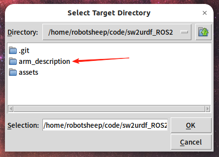
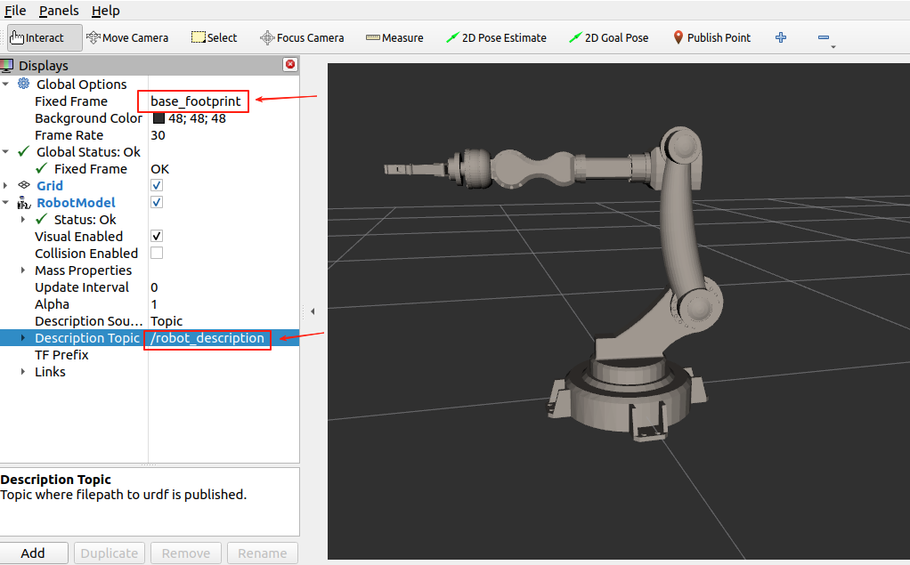

# SW2URDF ROS2
**If you want to export ROS2 function packages directly in solidworks, please see this project https://github.com/fish1sheep/solidworks_urdf_exporter**  （**But No Gazebo launch**）
## Environment Setup

1. Ubuntu
2. ROS2
3. Gazebo11
4. gazebo_ros
5. robot_state_publisher
6. joint_state_publisher

## Install Dependencies

```bash
# Install Gazebo and gazebo_ros
sudo apt install gazebo && sudo apt install ros-$ROS_DISTRO-gazebo-ros-pkgs
```

```bash
# Install robot_state_publisher and joint_state_publisher
sudo apt install ros-$ROS_DISTRO-robot-state-publisher && sudo apt install ros-$ROS_DISTRO-joint-state-publisher
```

## Tool Description

Run `dir_ros2.py` to select the directory generated by sw2urdf. This will automatically convert the sw2urdf output directory into a ROS2-compatible package.

The package can be visualized in **rviz2** and **gazebo**.

## Necessary Configuration

Set the geometric relationship between `base_footprint` and `base_link` in the `insert_urdf.txt` file:

```xml
  <link name="base_footprint"/>

  <joint name="base_footprint_joint" type="fixed">
      <origin xyz="0 0 0.001" rpy="0 0 0" />
      <parent link="base_footprint"/>
      <child link="base_link" />
  </joint>
```

## Running Test

### Convert Directory

1. Run `dir_ros2.py`.


1. Select the directory where sw2urdf was generated. Remember to back up the original directory before proceeding, in case of any issues.



1. Go into the directory, then click OK and wait for the conversion to complete.


1. Move the converted directory to the `src` folder of your ROS2 workspace. Run `colcon build` and source the workspace.

### rviz2

Run the **display.launch.py** launch file

> Note: The `arm_description` directory is used as an example.

```bash
ros2 launch arm_description display.launch.py
```

Make sure to set the following:

- **Fixed Frame**: Choose **base_footprint**.
- **Description Topic**: Choose **/robot_description**.



### Gazebo

Run the **gazebo.launch.py** launch file

> Note: The `arm_description` directory is used as an example.

```bash
ros2 launch arm_description gazebo.launch.py
```


In this case, the model is loaded correctly, but no controllers were added, so the behavior shown is due to the absence of control mechanisms.
